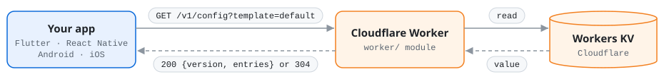

# Cloudflare Workers KV Remote Config for Flutter

Remote config for Flutter apps, stored in **Cloudflare Workers KV**: in-app
defaults, fetch and activate, typed getters and an offline cache.

This repository holds two independent modules:

| Module | What it is                                                         | Docs |
| --- |--------------------------------------------------------------------| --- |
| [`flutter/`](flutter/) | The `cloudflare_worker_kv` Flutter package                         | [flutter/README.md](flutter/README.md) |
| [`worker/`](worker/) | The Cloudflare Worker that reads remote KV and serves it over HTTP | [worker/README.md](worker/README.md) |

The modules share only an HTTP contract
([`GET /v1/config`](flutter/README.md#http-contract)). Each one is built,
tested and released on its own.

## How it works



- **Workers KV** stores the config: a new namespace, or one you already have
  with data in your own layout.
- **The Worker** only reads KV. It returns the parameters as strings, with an
  `ETag` so unchanged config costs a `304`. The app never holds a Cloudflare
  API token ([why this matters](#why-not-read-workers-kv-directly-from-flutter)).
- **The package** gives the app defaults, `fetch` / `activate`, typed getters
  and an offline cache.

## Getting started

1. **Put your config in Workers KV.** Store the simplest layout, one JSON
   object under the key `config:default`, or describe your existing layout
   with a few variables.
   See [worker: describe your data](worker/README.md#2-describe-your-data).
2. **Deploy the Worker** with Wrangler (`npm run deploy`). An existing Worker
   can be reused.
   See [worker: deploy](worker/README.md#4-deploy-with-wrangler).
3. **Check the Worker.** Your parameters must appear in `entries`:

   ```bash
   curl -i "https://<worker>.<subdomain>.workers.dev/v1/config"
   ```

4. **Use it in your app.** Add the package and point it at the Worker URL.
   See [flutter/README.md](flutter/README.md#getting-started).
5. **Change config.** Edit the value in KV. Apps see it about 1–2 minutes
   later, on their next fetch after `minimumFetchInterval`.
   See [worker: updating data](worker/README.md#6-publishing-and-updating-data).

## Troubleshooting

| Symptom | Where to look |
| --- | --- |
| `entries` is empty, or the Worker returns an error status | [worker: troubleshooting](worker/README.md#9-troubleshooting) |
| KV changed but the app did not | [worker: freshness](worker/README.md#8-costs-limits-and-freshness), then `minimumFetchInterval` in [flutter: behaviour](flutter/README.md#behaviour) |
| `RemoteConfigException` in the app | [flutter: behaviour](flutter/README.md#behaviour) |

## Repository layout

```
README.md          this guide
flutter/           Flutter package (pubspec.yaml, lib/, test/, example/)
worker/            Cloudflare Worker (src/, test/, scripts/, wrangler.jsonc)
```

## FAQ

### Why not read Workers KV directly from Flutter?

Workers KV has no public read endpoint. Outside a Worker, the only way to read
it is the [Cloudflare REST API](https://developers.cloudflare.com/kv/api/read-key-value-pairs/),
which requires an API token. Reading KV from the app means shipping that
token inside the app:

| Problem | Consequence |
| --- | --- |
| The token ships with the app | Anyone can extract it from an APK/IPA or from the JavaScript of a web build. KV permissions on API tokens cover the whole account, so it opens every namespace, and a token with write access lets anyone change your config. Replacing it needs a new app release. |
| One rate limit for all users | The Cloudflare API allows [1,200 requests per 5 minutes per user](https://developers.cloudflare.com/fundamentals/api/reference/limits/). Every install of the app shares it, together with your own dashboard and Wrangler use. Past the limit, all API calls are blocked for 5 minutes. |
| No Flutter web support | The API sends no CORS headers, so browsers block the request. |
| No caching or change detection | Every fetch downloads the full value: no `ETag` / `304`, no edge cache, and one request per parameter with the `keys` layout. |

The Worker removes each of these. It reads KV through a binding, so the app
holds no credentials, and it exposes only the configured key or prefix,
read-only. It caches reads at the edge, returns all parameters in one response
with an `ETag`, and sends CORS headers. The Workers Free plan includes 100,000
requests per day.

## License

MIT, see [LICENSE](LICENSE).
