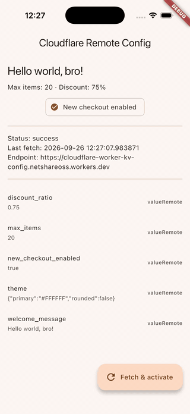
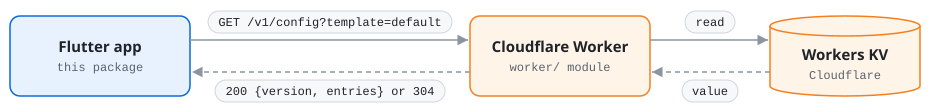

# cloudflare_worker_kv

Remote config for Flutter, backed by **Cloudflare Workers KV**.

- In-app defaults, `fetch` / `activate` / `fetchAndActivate`
- Typed getters: `getString`, `getBool`, `getInt`, `getDouble`, `getValue`, `getAll`
- `RemoteConfigSettings` with `fetchTimeout` and `minimumFetchInterval`
- Offline cache: the last activated config is restored on the next launch
- Bandwidth-friendly: `ETag` / `304 Not Modified`
- Works on Android, iOS, macOS, Windows, Linux and web

Not using Flutter? The same remote config is available for
[React Native](https://github.com/huynguyennovem/cloudflare-worker-kv/tree/main/react-native),
[Android](https://github.com/huynguyennovem/cloudflare-worker-kv/tree/main/android) and
[iOS](https://github.com/huynguyennovem/cloudflare-worker-kv/tree/main/ios), with the
same behaviour.

## Demo



The [example app](example/lib/main.dart): `welcome_message` is changed in
Workers KV, then *Fetch & activate* picks up the new value.

## How it works



The package talks to a small read-only Cloudflare Worker, so your app never
holds a Cloudflare API token. The Worker, and how to deploy it against your KV
namespace, lives in the
[`worker/` module](https://github.com/huynguyennovem/cloudflare-worker-kv/tree/main/worker)
of this repository. Any backend that implements the [HTTP contract](#http-contract)
works too.

## Getting started

You need the URL of a deployed Worker, e.g.
`https://my-config.<subdomain>.workers.dev`: `npm run deploy` prints it, and
the Cloudflare dashboard lists it under **Workers & Pages → your Worker →
Settings → Domains & Routes**
([details](https://github.com/huynguyennovem/cloudflare-worker-kv/blob/main/worker/README.md#find-the-worker-url)).

```yaml
dependencies:
  cloudflare_worker_kv: ^0.1.0
```

```dart
import 'package:cloudflare_worker_kv/cloudflare_worker_kv.dart';

Future<void> main() async {
  WidgetsFlutterBinding.ensureInitialized();

  final remoteConfig = await CloudflareRemoteConfig.initialize(
    endpoint: Uri.parse('https://my-config.<subdomain>.workers.dev'),
    clientKey: 'optional-client-key', // only if the Worker sets CLIENT_KEY
  );
  await remoteConfig.setConfigSettings(RemoteConfigSettings(
    fetchTimeout: const Duration(seconds: 10),
    minimumFetchInterval: const Duration(hours: 1),
  ));
  await remoteConfig.setDefaults(const {
    'welcome_message': 'Hello',
    'max_items': 10,
    'new_checkout_enabled': false,
  });

  try {
    await remoteConfig.fetchAndActivate();
  } on RemoteConfigException catch (e) {
    // Offline, timeout, ... cached or default values are still available.
    debugPrint('Remote config fetch failed: $e');
  }

  runApp(MyApp());
}

// Anywhere in the app:
final rc = CloudflareRemoteConfig.instance;
final maxItems = rc.getInt('max_items');
final newCheckout = rc.getBool('new_checkout_enabled');
```

Values are delivered as strings and converted by the typed getters. A
parameter stored as a JSON object or array arrives as JSON text:

```dart
final units = jsonDecode(rc.getString('ad_units')) as Map<String, dynamic>;
```

See [`example/`](example/lib/main.dart) for a complete app.

### Migrating from Firebase Remote Config

| firebase_remote_config                    | cloudflare_worker_kv                           |
| ----------------------------------------- | ---------------------------------------------- |
| `FirebaseRemoteConfig.instance`           | `CloudflareRemoteConfig.instance` (after `initialize`) |
| `setConfigSettings(RemoteConfigSettings)` | same                                           |
| `setDefaults(Map)`                        | same                                           |
| `ensureInitialized()`                     | same (done by `initialize`)                    |
| `fetch()` / `activate()` / `fetchAndActivate()` | same                                     |
| `getString/Bool/Int/Double/Value/getAll`  | same                                           |
| `lastFetchTime`, `lastFetchStatus`, `settings` | same                                      |
| `RemoteConfigValue`, `ValueSource`        | same                                           |
| `FirebaseException`                       | `RemoteConfigException` (`code`, `statusCode`) |
| `onConfigUpdated`                         | not yet                         |
| Conditions, A/B testing, personalization  | not supported                                  |

## Behaviour

- **Value resolution:** activated remote value → default → static
  (`''`, `0`, `0.0`, `false`). `getValue(key).source` tells you which.
- **Conversions:** `asBool()` is `true` for `1, true, t, yes, y, on`
  (case-insensitive). `asInt()` / `asDouble()` return `0` / `0.0` when the
  value cannot be parsed. Conversions never throw.
- **`fetch()`** never changes what the getters return; call `activate()`.
  Within `minimumFetchInterval` of the last successful fetch it completes
  without a network request. Concurrent calls share one request.
- **`activate()`** returns `true` only when a fetched config differs from the
  active one.
- **Errors:** `fetch()` throws `RemoteConfigException` with a `code` of
  `timeout`, `network-error`, `unauthorized`, `throttled`, `server-error` or
  `invalid-response`. A failed fetch never touches the active config.
  HTTP 429 sets `lastFetchStatus` to `throttle` and blocks fetches until
  `throttleEndTime` (from `Retry-After`, default 1 minute).
- **Freshness:** a change made in KV reaches the Worker after about 1–2
  minutes. The app picks it up on its next fetch, which `minimumFetchInterval`
  may delay.
- **Persistence:** active and pending config, `ETag`, settings and fetch
  status are stored with `shared_preferences` (`SharedPreferencesAsync`).
  Provide your own `ConfigStorage` to change that. Defaults are not
  persisted — set them on every launch.
- **Multiple configs:** create extra instances with
  `CloudflareRemoteConfig(endpoint: ..., template: 'staging')`; each
  endpoint/template pair has its own cache.

## Security

- The Worker only exposes **read** access to your config.
  Do not put secrets in remote config — anyone with the app can read it.
- `clientKey` is a shared value compiled into the app. It keeps casual
  traffic away from your Worker but is **not** a secret. Combine with
  [Cloudflare rate limiting](https://developers.cloudflare.com/waf/rate-limiting-rules/)
  if you need abuse protection.

## Platform setup

- **Android:** release builds need
  `<uses-permission android:name="android.permission.INTERNET" />`.
- **macOS:** add `com.apple.security.network.client` to both
  `DebugProfile.entitlements` and `Release.entitlements`.
- **Web:** the Worker sends CORS headers, no extra setup needed.

## HTTP contract

```
GET {endpoint}/v1/config?template={template}
  Request headers:  X-Client-Key (optional), If-None-Match (optional)
  200  {"version": "<opaque>", "entries": {"key": "value", ...}}   + ETag header
  304  when If-None-Match matches
  401/403 bad client key · 429 rate limited (Retry-After) · 5xx errors
```

The full contract, including the client behaviour every SDK shares, is in
[spec/README.md](https://github.com/huynguyennovem/cloudflare-worker-kv/blob/main/spec/README.md).

## Running the tests

```bash
flutter test
```

`test/conformance_test.dart` runs the fixtures shared by all SDKs from
`../spec/fixtures`, so run the tests from a checkout of the whole repository.

## Roadmap

- `onConfigUpdated` stream (polling + `ETag`)
- Conditional values (platform, app version, percentage rollout)
- Authenticated admin endpoint for publishing config
